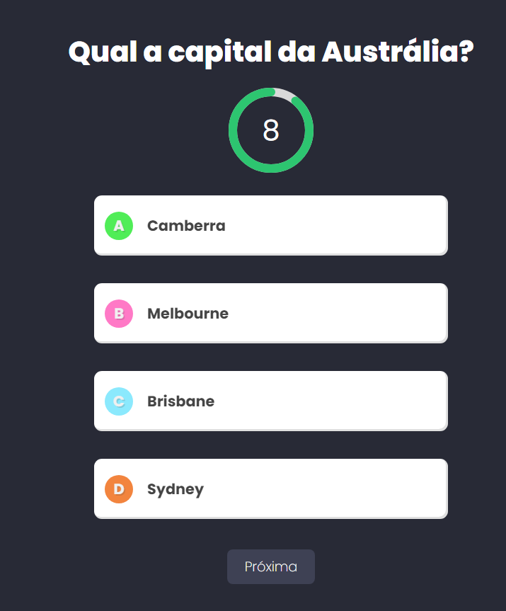

# O melhor quiz do mundo!

### Sobre
Quiz feito totalmente com Next.JS com integração TypeScript. O web-app basicamente funciona como um questionário em que cada pergunta deve ser respondida em até 8 segundos. Ao finalizar todas as questões, uma tela com o número de respostas corretas e o percentual de acerto é mostrado.

### Tecnologias e Integrações
- JavaScript
- TypeScript
- CSS3
- React
- Next.js 

### Uso e instalação
- Para instalar as dependências: Npm install
- Há 10 perguntas no teste
- O tema das interrogações é variado
- Você terá 8 segundos para responder cada questão
- Para avançar ao responder um questionamento, basta clicar em "próximo"
- Ao fim das dez perguntas, clique em "Terminar"

